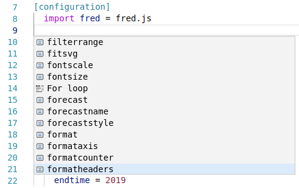
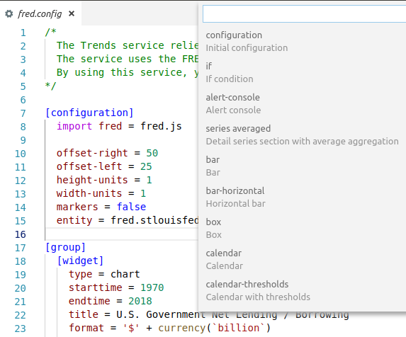
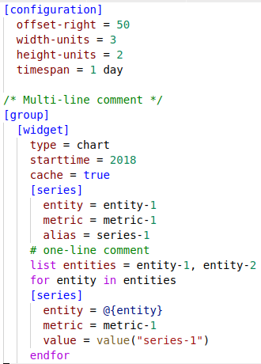
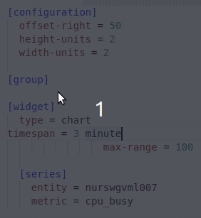

# Axibase Charts Syntax

[](https://app.codacy.com/app/kirmanak/Axibase-Charts-Syntax?utm_source=github.com&utm_medium=referral&utm_content=kirmanak/Axibase-Charts-Syntax&utm_campaign=badger) [](https://travis-ci.org/kirmanak/Axibase-Charts-Syntax) [](https://www.codefactor.io/repository/github/kirmanak/axibase-charts-syntax)

VSCode extension supporting [Axibase Charts](https://github.com/axibase/charts/blob/master/README.md) syntax. The plugin performs syntax highlighting and validation.

## Installation

After the release, the plugin will be available at VSCode marketplace. For now, follow these instructions:

* Clone `Axibase Charts Syntax` repository.

  ```bash
  git clone https://github.com/kirmanak/axibase-charts-syntax.git ~/.vscode/extensions/axibase-charts
  ```

* `cd` into the newly created directory.

  ```bash
  cd ~/.vscode/extensions/axibase-charts
  ```

* Install node modules and compile the extension.

  ```bash
  npm install && npm run compile
  ```

* Plugin is ready to handle `.config` extension files.
  * See examples in ``~/.vscode/extensions/axibase-charts/examples/``.

## Update

After the release, the updates will be downloaded and installed automatically by VSCode. For now, follow these instructions:

* `cd` to the plugin folder

```bash
cd ~/.vscode/extensions/axibase-charts
```

* Update the plugin

```bash
git pull && npm install && npm run compile
```

## Introduction

To display the list of available completions (such as snippets or settings like `entity`, `metric`...), press `Ctrl+Space` on PC or `⌃Space` on Mac.

  

### User Defined Completions

#### Snippets

* To display the list of pre-configured snippets, press `Ctrl+Shift+P` on PC or `⇧⌘P` on Mac, then write `Insert Snippet`.

  

* To add new snippets to your VSCode installation follow the official [documentation](https://code.visualstudio.com/docs/editor/userdefinedsnippets).

* To add new snippets to the extension use `snippets/snippets.json` file. Pre-configured snippets can be used as examples.

#### Settings

* To add new settings to the completion list, add them to `possibleOptions` array in `server/src/resources.ts` and recompile the extension.

  ```bash
  npm run compile
  ```

## Configuration

* `axibaseCharts.validateFunctions`
  * Default is `false`
  * If `true`, enables inline JS validation
  * The plugin executes JS which is written in `script = ... endscript`, `script =`, `value =`, `replace-value =` statements.

* `axibaseCharts.url`
  * Default is `null`
  * The URL address of the target ATSD, which is used to show the preview of the portal

* `axibaseCharts.username`
  * Default is `null`
  * The username of the ATSD user, which is used to connect to the ATSD to show the preview of the portal

## Bug-reports

Attach VSCode and the plugin version to your bug-report:

* VSCode version is listed in **Help > About** page.

* To get the plugin version, follow these instructions:

  * `cd` to the plugin directory

    ```bash
    cd ~/.vscode/extensions/axibase-charts
    ```

  * Print last commit hash, which is the plugin version for now:

    ```bash
    git rev-parse HEAD
    ```

## Features

### Show preview

The plugin can show the preview of the portal right in the VSCode using the target ATSD. To see preview follow these instructions:

* Open your portal configuration in `*.config` file (might contain unsaved changes).
* Press `Show preview` button on title bar (right upper corner)
* Enter the target ATSD URL if did not configure it in [User settings](#Configuration)
* Enter the username of the target ATSD user if did not configure it in [User settings](#Configuration)

  You can skip this step via `Esc` or `Enter` buttons if `api.guest.access.enabled` is `true` in `Server properties`.
* Enter the password if entered the username previously.

To change the target ATSD URL, open `Command Palette` (`F1`, `Ctrl+Shift+P` on PC or `⇧⌘P` on Mac), execute `Axibase Charts: Change the target ATSD URL` command.

### Syntax highlighting

Theme used to create the screenshot is `Light+(default light)` (Choose theme by **File > Color theme**).



### Code prettifier



### Snippets

* `{widget_name}`: creates a new `[widget]` section with a pre-configured sample widget from Charts library
* `configuration`: creates a new `[configuration]` section with child `[group]` section and several initial settings
* `for`: creates a new `for` loop with corresponding `endfor`.
* `if`: creates a new `if` statement with corresponding `endif`.
* `series {type}`, where type one of `with tags`, `detail`, `averaged`: creates a new `[series]` section.
* `portal: 3x2`: creates a new portal with 6 widgets: 3 columns, 2 rows.

### Validation

The following errors are validated by the plugin:

* JS errors (syntax, undefined variables, etc.) when `axibaseCharts.validateFunctions` is `true`:

  ```txt
  script
    widget = hello() // widget is allowed variable, since it comes from Charts
    // hello() is unknown function, the plugin warns about it
  endscript
  ```

  ```txt
  [series]
    value = 5 + ; // forgotten operand
  ```

* Dereference unknown `alias`:

  ```txt
  [series]
    alias = s1

  [series]
    value = value('s1')
  ```

* Unfinished `for`, `csv`, `var`, `list`, `script`, `if` blocks:

  ```txt
  list values = value1, value2,
    value3, value4
  # no matching endlist
  ```

* Incorrect `csv`:

  ```txt
  csv servers =
    name, price
    vps, 5
    vds, 5, 4 /* wrong number of columns */
  endcsv
  ```

* Unmatched `endcsv`, `endif`, `endfor`, `endvar`, `endscript`, `endlist`:

  ```txt
  var array = [
    "value1", "value2"
  ]
  endlist
  # endlist can not finish var statement
  ```

* Dereference of an undefined variable in `for` block:

  ```txt
  for server in servers
    [series]
      entity = @{srv} /* for variable is server, but srv is used */
  endfor
  ```

* Usage of an undefined collection in `for` block:

  ```txt
  list servers = vps, vds
  for server in serverc /* misspelling */
    [series]
      entity = @{server}
  endfor
  ```

* `else` or `elseif` statement without corresponding `if`:

  ```txt
  for item in collection
    [series]
    # no 'if' keyword
    elseif item == 'vps'
      metric = vps
    else
      metric = vds
    endif
  endfor
  ```

* Repetition of variable:

  ```txt
  list collection = value1, value2
  var collection = [ "value1", "value2" ]
  # duplicate variable name
  ```

  ```txt
  for server in servers
    for server in servers
      # duplicate variable name
    endfor
  endfor
  ```

* Repetition of a setting:

  ```txt
  [series]
    entity = server
    entity = srv /* duplicate setting */
    metric = cpu_busy
  ```

* Omitting of a required setting:

  ```txt
  [widget]
    # type is required
    [series]
    ...
  ```

  ```txt
  [series]
    entity = server
    # metric is required
  [widget]
  ```

* Misspelling in a setting name:

  ```txt
  [wigdet]
    # "wigdet" instead of "widget"
    type = chart
  ```

  ```txt
  [series]
    startime = now
    # "startime" instead of "starttime"
  ```

* `for` has finished before `if`:

  ```txt
  for server in servers
    [series]
      if server == 'vps'
        entity = 'vds'
      else
        entity = 'vps'
  endfor
  # if must be finished inside the for
  endif
  ```

* Setting is interpreted as a tag:

  ```txt
  [tags]
    server_name = 'vds'
  time-span = 1 hour
  # time-span will be interpreted as a tag
  ```
